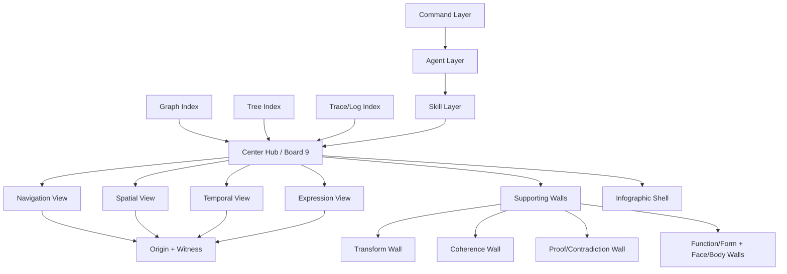

# Stack Spec v0.1 — Center-Routed Communication Atlas

## 1) Mission

Build a **topological operating system for human + AI communication**:

> A center-routed, multi-view, coherence-audited atlas that lets one subject survive many projections without losing identity, authority, timing, or proof.

### Core design law

> **The hub navigates. The walls prove. The shell communicates.**

---

## 2) System topology

---

## 3) Layered architecture

## Layer 0 — Governing Standard

Defines invariants and stopping conditions.

- Prime purpose: utility maximization through coherent transformation.
- Authority classes: truth, norm, function, contract.
- Invariant registry: subject identity, scope, phase role, perspective, time ordering, evidence linkage.
- Coherence standard: conditions for “same artifact” across transformations.
- Stopping rule: what “coherent enough to ship” means.

## Layer 1 — Ontology Layer

Object grammar for all views.

### Entity types
- subject
- actor
- event
- metric
- artifact
- symbol
- rule
- relation
- process (first-class)

### Core coordinates
- `ρ` depth / pressure radius
- `α` angular sector
- `p` discrete regime state (`ideal | boundary | core`)
- `φ` continuous signal phase
- `π` perspective (`origin | witness`)
- `μ` magnitude / salience
- `τ` time scale
- `κ` context

### Cross-cutting axes
- 1st Person ↔ Witness
- Function ↔ Form
- Face ↔ Body
- Word ↔ Number ↔ Symbol
- Core ↔ Boundary ↔ Ideal
- Pressure ↔ Relief

## Layer 2 — Dynamic Engine (NLPO)

Operational timing and state mechanics.

- `p(t)` = discrete regime category
- `φ_i(t)` = continuous oscillatory phase
- amplitude / salience
- latency
- cadence
- repair rate
- sync and drift heuristics
- degradation and recovery rules
- baseline calibration
- multi-actor coupling logic

## Layer 3 — Transform Layer

Lawful conversions across views and artifacts.

### Transform families
- approximation
- projection
- compression
- expansion
- mirroring
- temporalization
- rendering
- routing
- aggregation
- decomposition

### Transform card schema (minimum)
- source type signature
- target type signature
- allowed losses
- contradiction checks
- reversibility label
- certification status

## Layer 4 — Retrieval / Indexing Layer

Three specialized memory systems (not one monolith):

1. **Graph index**: code dependencies, call chains, clusters, processes, impact.
2. **Tree index**: hierarchical document retrieval and section-level reasoning.
3. **Trace index**: logs, events, audits, route history, state transitions.

## Layer 5 — Agent Orchestration Layer

Command → Agent → Skill operating model.

### Command examples
- `/navigate`
- `/place`
- `/compare`
- `/route`
- `/render`
- `/audit`
- `/transform`
- `/nlpo-log`
- `/coherence-check`

### Agent roles
- Navigator Agent
- Spatial Mapper
- Temporal Oscillator Analyst
- Expression Compiler
- Transform Auditor
- Coherence Judge
- Retrieval Librarian

### Skill packs
- sector dictionary
- board grammar
- transform library
- coherence audit
- NLPO scoring
- proof-strip generation
- workbook export rules

## Layer 6 — Board Atlas Layer

### Board 9 (center hub)
Must hold only:
- active subject
- authority class + label
- current coordinate
- regime state
- time scale
- active tension
- mode
- next-best-board
- artifact target
- confidence
- contradiction status

**Board 9 role:** router + zoom root + state snapshot.

### 8-board ring (origin/witness symmetry)
- B1 Navigation (origin)
- B2 Spatial (origin)
- B3 Temporal (origin)
- B4 Expression (origin)
- B5 Navigation (witness)
- B6 Spatial (witness)
- B7 Temporal (witness)
- B8 Expression (witness)

### Four canonical view families
1. Navigation — where am I / what applies?
2. Spatial — how is it arranged?
3. Temporal — when/how is it moving?
4. Expression — how should it render/export?

## Layer 7 — Logging + Measurement

### Required fields
- subject_id
- timestamp
- actor
- context
- phase
- amplitude
- latency
- cadence
- repair_rate
- sync_score
- drift_score
- contradiction_flag
- confidence
- recommended_board
- chosen_transform
- output_artifact
- proof_source

### Required logs
- `NLPO_Log`
- `Transform_Log`
- `Coherence_Audit_Log`
- `Route_Log`
- `Proof_Log`
- `Board_State_Log`

## Layer 8 — Audit Layer

Every board and transform must expose:
- proof strip
- contradiction flag
- freshness tag
- confidence tag
- source link
- coherence status

Every artifact must pass checks:
- identity preserved?
- authority preserved?
- scope preserved?
- time ordering preserved?
- evidence linked?
- unresolved contradiction?

---

## 4) UI specification

### Global top band (always visible)
- Subject
- Authority
- Scope
- Timescale
- Mode
- Confidence
- Status

### Main center
- Board 9 radial mind-map tree
- zoom root and board routing

### Side walls
- Left: structure / tensions / transforms
- Right: proof / artifacts / contradictions

### Bottom strip
- next move
- owner
- due/cadence
- proof target
- state update target

### Zoom levels
- L0 Hub
- L1 Board
- L2 Cluster
- L3 Atom

---

## 5) Hard design rules

1. Utility over ornament.
2. Fixed grammar, moving perspective.
3. Function-first composition.
4. Token-conscious modularity and progressive disclosure.
5. Fractal repeatability across note→cluster→board→atlas→workbook.
6. Explicit handling of loss, compression, and contradiction.
7. Renderer discipline:
   - words reflect,
   - numbers measure/compare,
   - symbols route,
   - diagrams relate.

---

## 6) Phase plan

### Phase 1 — Grammar lock
- board grammar
- entity schema
- transform card
- coherence audit
- top/proof/action strips

### Phase 2 — Center hub
- Board 9 wireframe + radial tree
- zoom levels
- route selection
- subject registry

### Phase 3 — Core walls
- one navigation wall
- one spatial wall
- one temporal wall
- one expression wall

### Phase 4 — Logs + audit
- required logs
- contradiction handling
- coherence checks

### Phase 5 — Agent operations
- command endpoints
- agent role execution
- skill loading and routing helpers

### Phase 6 — Infographic shell
- compose communication export from stabilized hub/walls

---

## 7) Non-goals

- No single mega-image as authoring substrate.
- No single index for all memory types.
- No conflation of discrete regime state and continuous phase.
- No treating symbolic mnemonics as empirical evidence.
- No overloading Board 9 with specialist analysis.

---

## 8) Deliverable definition of done (v0.1)

v0.1 is complete when:

1. The 9-board atlas contract is explicitly encoded.
2. Graph/tree/trace indices are each defined with clear retrieval responsibilities.
3. Command→Agent→Skill routing exists for at least 4 commands.
4. Transform cards and coherence audits are attached to all generated artifacts.
5. Minimal mode is implemented with top band + hub snapshot + one active board + proof strip + action strip.

